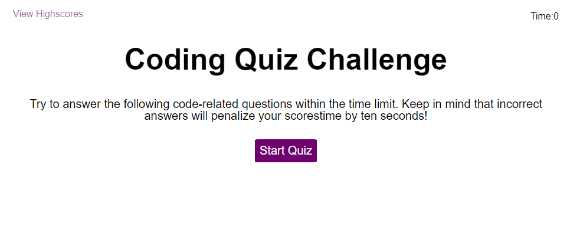

# Code Quiz

## Description

This week's challenge allows the bootcamp students to build a timed coding quiz with multiple-choice questions. This app will run in the browser, and will feature dynamically updated HTML and CSS powered by JavaScript code that we write. It will have a clean, polished, and responsive user interface. 

## Installation

N/A

## Usage

To use the Code Quiz Application, you can copy and paste this link into your browser: https://miloyang.github.io/Code-Quiz

The page should open as per below screenshots:

The HTML, CSS and Javascript code can be seen when you open the Chrome DevTools by pressing Command+Option+I (macOS) or Control+Shift+I (Windows). A console panel should open either below or to the side of the webpage in the browser. Head into the Elements, Styles and Sources tab, and there you will see the codes. 

When you click on the Start Quiz button, you will be presented with a multiple-choice question and also the timer will start the countdown. 

When you answer a question, you will be presented with another question along with the option that you either answered the previous question correctly or incorrectly. 

When a question is answered incorrectly, a total of 5 seconds will be substracted from the time left.

When all questions are answered or the timer reaches 0, then the game is over. 

When the game is over, a score will be presented and you will be able to save your initials along with the scores. 

The page will have a responsive layout that adapts the viewport, when you resize the page or view the site on various screens and devices.

## Credits

Coding Bootcamp by USYD x EDX

## License

Please refer to the LICENSE in the repo.
